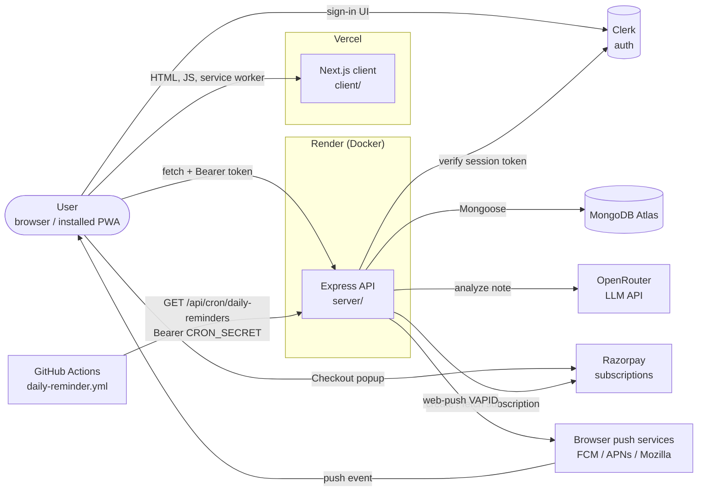
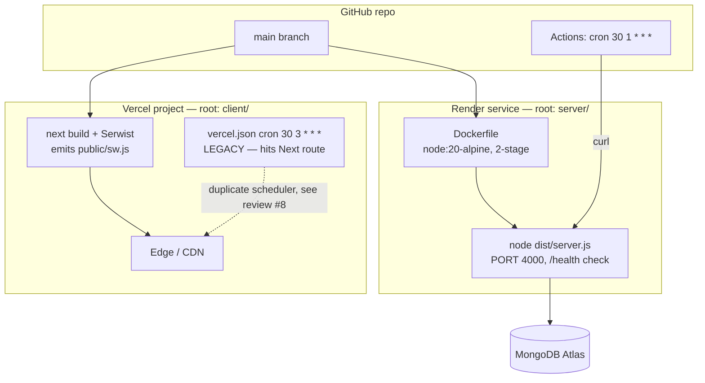
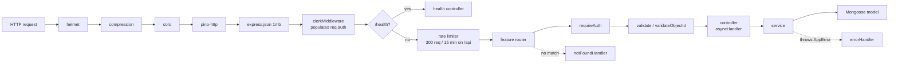
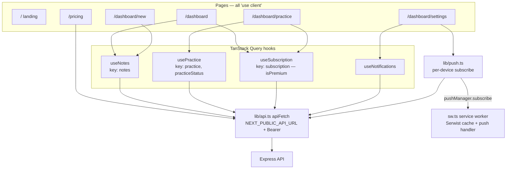
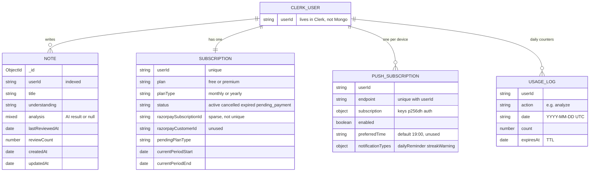
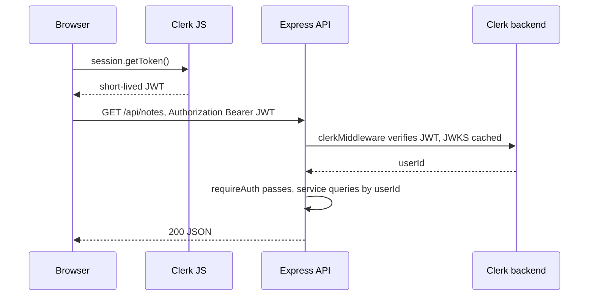
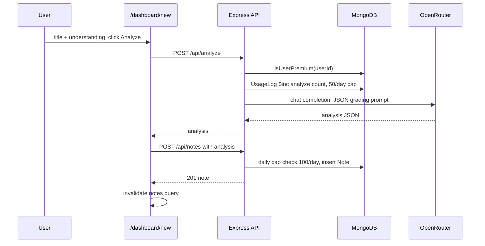
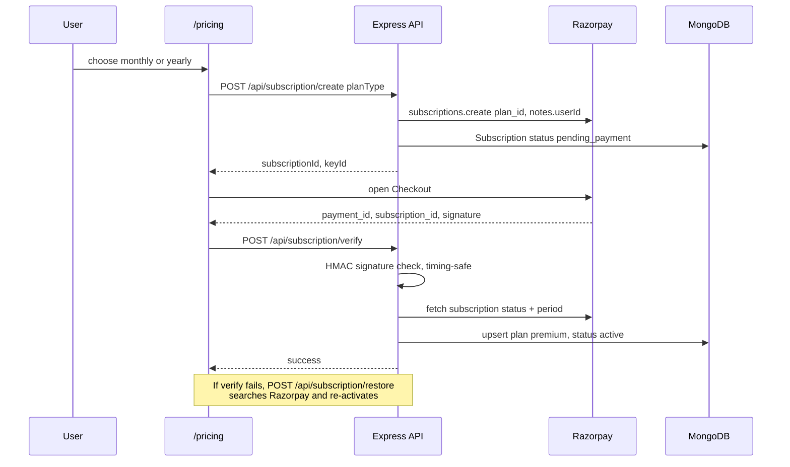
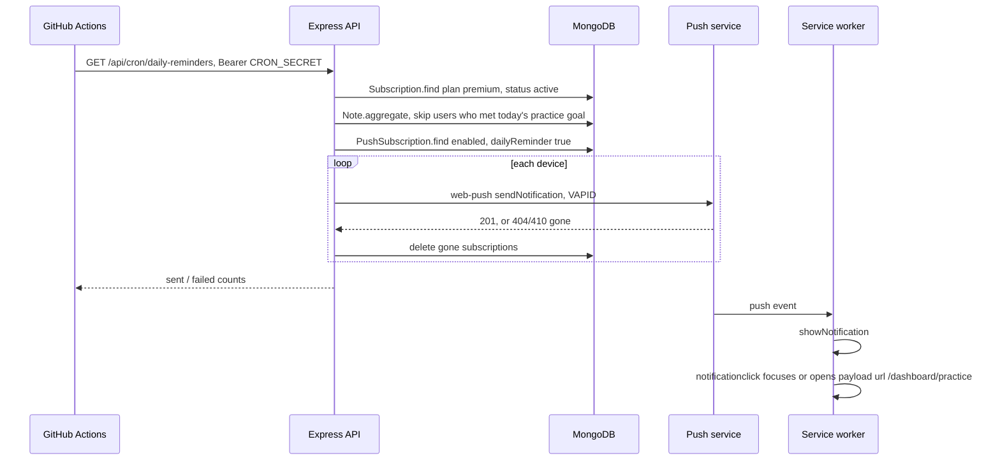

# MemoMind — Architecture

MemoMind is a learning app. Users write down what they understood about a topic ("notes"). An LLM grades that understanding and flags gaps. Spaced daily practice and push reminders help users retain it. AI analysis, practice and reminders are premium features, paid through Razorpay subscriptions.

This document is the top-level map. Details live in:

- [server.md](server.md) — Express backend: API reference, middleware chain, env vars, every file.
- [client.md](client.md) — Next.js frontend: routes, data layer, PWA, design system, every file.
- [review.md](review.md) — known bugs and risks, ranked.

---

## 1. Repository layout

```
MemoMind/
├── client/                  Next.js 15 app (App Router) — deployed on Vercel
│   ├── app/                 pages, components, hooks, lib, service worker (sw.ts)
│   ├── app/api/**           LEGACY Next.js API routes (pre-migration backend, unused)
│   ├── middleware.ts        Clerk route protection
│   └── public/              manifest, icons, generated sw.js
├── server/                  Express + TypeScript backend — deployed on Render (Docker)
│   └── src/
│       ├── routes/          URL → controller wiring
│       ├── middlewares/     auth, validation, rate limit, logging, errors
│       ├── validators/      request body checks
│       ├── controllers/     HTTP adapters (thin)
│       ├── services/        business logic
│       ├── models/          Mongoose schemas
│       ├── config/          env, db, Clerk, Razorpay, OpenRouter
│       └── utils/ types/
├── .github/workflows/
│   └── daily-reminder.yml   scheduler for daily push reminders
└── docs/                    this documentation
```

## 2. System context



Key points:

- **The browser calls the Express API directly** (cross-origin). The Next.js app serves only UI. It does no server-side data fetching.
- **Auth is Clerk end-to-end.** The client gets a session JWT from `window.Clerk.session.getToken()` and sends it as `Authorization: Bearer …`. Express verifies it with `@clerk/express`.
- **Every document is keyed by the Clerk `userId` string.** There is no users collection.
- **The server has no scheduler.** GitHub Actions triggers the reminder endpoint once a day.

## 3. Deployment view



| Piece | Host | Config source |
|-------|------|---------------|
| Frontend | Vercel | `client/next.config.mjs`, `client/vercel.json`, Vercel env |
| Backend | Render (`memomind-zqw3.onrender.com`) | `server/Dockerfile`, Render env (no `render.yaml` in repo) |
| Scheduler | GitHub Actions | `.github/workflows/daily-reminder.yml`, secret `CRON_SECRET` |
| Database | MongoDB Atlas | `MONGODB_URI` (server only) |

## 4. Backend request lifecycle



Layer rules: controllers only parse the request and shape the response. Services hold all business logic and throw `AppError(status, message)`. `errorHandler` converts errors to JSON. The response shapes match the old Next.js routes, so the client did not change during the migration.

## 5. Frontend architecture



- `middleware.ts` (Clerk) protects every route except `/`, `/pricing`, `/sign-in`, `/sign-up`, `/manifest.json`, and the legacy `/api/webhooks` and `/api/cron` routes.
- `useSubscription` is the single source of `isPremium`. Premium-only queries are gated on it.
- Styling uses Tailwind plus HSL tokens in `globals.css`. The dark app scope is the default, `.light` switches to light, and `.theme-paper` is the marketing scope. The accent is terracotta. See [client.md](client.md#5-design-system-ink--ivory).

## 6. Data model



The server connects with `autoIndex: false`. The indexes above must already exist in Atlas, or be created manually. See [review.md #9](review.md#9-indexes-never-built).

## 7. Core flows

### 7.1 Authenticated API call



### 7.2 Write and analyze a note



### 7.3 Upgrade to premium



### 7.4 Daily reminder



## 8. Cross-cutting concerns

| Concern | How it's handled | Where |
|---------|------------------|-------|
| Authentication | Clerk JWT as Bearer header; Clerk middleware on both sides | `client/app/lib/api.ts`, `client/middleware.ts`, `server/src/config/clerk.ts`, `middlewares/auth.middleware.ts` |
| Authorization | Every query filtered by `userId`; premium gate via `isUserPremium` | `server/src/services/*` |
| Validation | Hand-written validators + `validateObjectId`; env via zod | `server/src/validators/`, `config/env.ts` |
| Rate limiting | `express-rate-limit` 300/15 min (in-memory); per-feature daily caps in Mongo | `middlewares/rateLimit.middleware.ts`, `UsageLog`, note service |
| Errors | `AppError` + `asyncHandler` + central `errorHandler` | `server/src/utils/`, `middlewares/error.middleware.ts` |
| Logging | pino / pino-http; structured payment events via `logPayment` | `server/src/utils/logger.ts` |
| Secrets | Server-only env; client only sees `NEXT_PUBLIC_*` (Clerk publishable key, VAPID public key, API URL) | `server/.env.example`, `client/.env.local.example` |
| Offline / PWA | Serwist precache + runtime cache; web push | `client/app/sw.ts`, `client/next.config.mjs` |
| Time | All day boundaries are UTC (`YYYY-MM-DD`) | `server/src/utils/date.ts` |

## 9. Known architectural debt

The full list is in [review.md](review.md). The structural items are:

1. **Legacy backend in `client/app/api/**`** is still built and deployed. `apiFetch` silently falls back to it when `NEXT_PUBLIC_API_URL` is unset.
2. **Two schedulers:** `client/vercel.json` cron and GitHub Actions.
3. **No Razorpay webhook**, so subscription state never changes after activation and premium never expires.
4. **Service worker caches cross-origin API responses** without regard to which user is signed in.
5. **Single-instance assumptions:** the in-memory rate limiter works per instance, and indexes are not auto-built.
