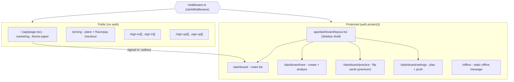
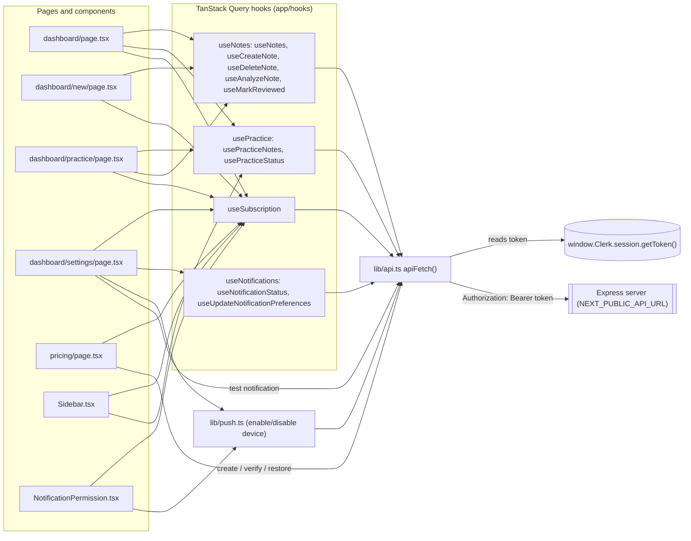
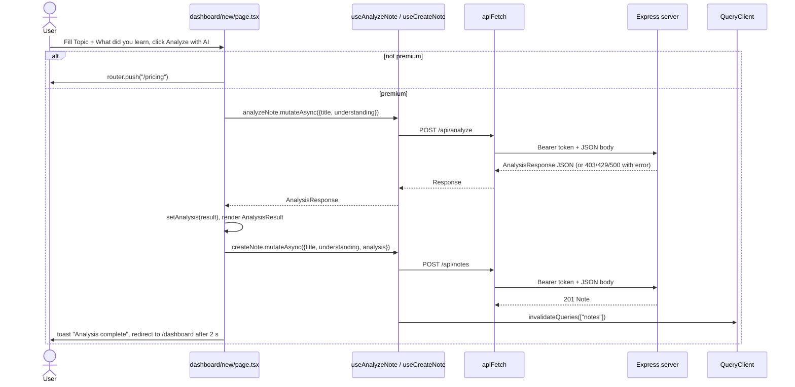
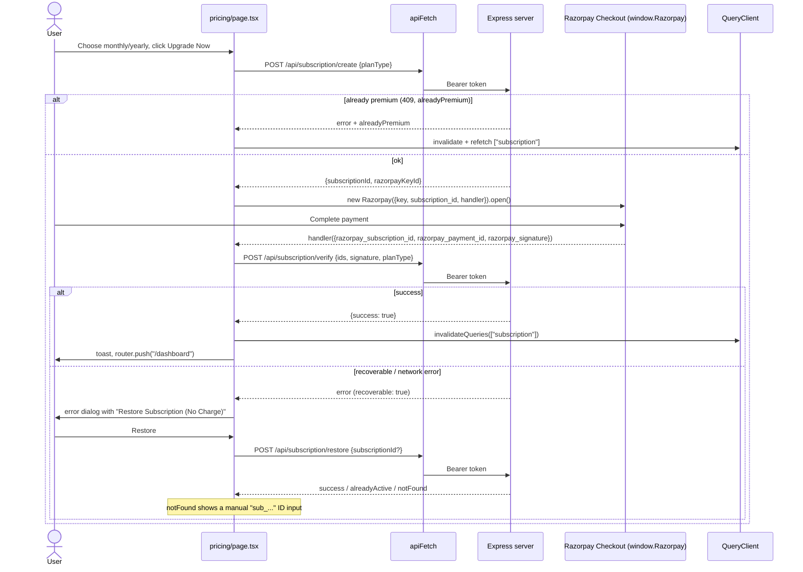
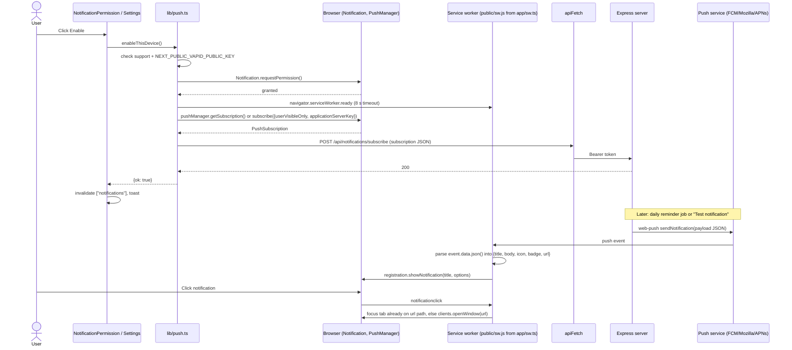

# MemoMind Frontend (`client/`)

Reference documentation for the Next.js frontend. Audience: engineers new to the codebase.

> **Status note (backend split).** The backend now runs as a standalone Express app in `../server`.
> The frontend talks to it through a single fetch wrapper, `app/lib/api.ts` (`apiFetch`), which
> prefixes `NEXT_PUBLIC_API_URL` and attaches the Clerk session token as a Bearer header.
> The original Next.js API routes (`client/app/api/**`) and their server-side helpers
> (`app/lib/mongodb.ts`, `app/lib/models/**`, `app/lib/checkPremium.ts`, `app/lib/paymentLogger.ts`)
> are still in the tree but are **legacy**. See [Live vs legacy code](#live-vs-legacy-code).

---

## 1. Overview

| Concern | What is used |
| --- | --- |
| Framework | Next.js 15.5 (App Router), React 18, TypeScript (strict) |
| Auth | Clerk (`@clerk/nextjs` v6): `ClerkProvider` in the root layout, `clerkMiddleware` in `middleware.ts`, prebuilt `<SignIn>`/`<SignUp>`/`<UserButton>` components |
| Server state | TanStack Query v5 (`@tanstack/react-query`), one `QueryClient` created in `app/providers.tsx` |
| API access | `apiFetch` (`app/lib/api.ts`) calls the Express backend with `Authorization: Bearer <Clerk token>` |
| PWA | Serwist (`@serwist/next` + `serwist`): `app/sw.ts` compiled to `public/sw.js` at build time; `public/manifest.json`; install prompt component |
| Push | Web Push API + VAPID public key on the client (`app/lib/push.ts`); push/notificationclick handlers in `app/sw.ts` |
| Payments | Razorpay Checkout script loaded on `/pricing`; order creation/verification on the backend |
| Styling | Tailwind CSS 3.4 + `tailwindcss-animate`, HSL CSS-variable tokens in `app/globals.css`, shadcn-style primitives in `app/components/ui/` built with `class-variance-authority` + `clsx` + `tailwind-merge` |
| Theming | Dark by default; light mode = `.light` class on `<html>` (set by a no-flash inline script and `ThemeToggle`). Marketing pages add a `.theme-paper` scope |
| Motion | `framer-motion` (landing page, `Typewriter`) |
| Icons / toasts | `lucide-react`, `react-hot-toast` |
| Font | Plus Jakarta Sans via `next/font/google`, exposed as `--font-sans` |

Almost every page is a Client Component (`'use client'`). There are no Server Components that fetch data; all data flows through TanStack Query hooks in the browser.

### Live vs legacy code

Determined by grepping imports across `client/`:

| File(s) | Status | Evidence |
| --- | --- | --- |
| `app/api/**` (12 route files) | **Legacy fallback.** Not called when `NEXT_PUBLIC_API_URL` is set. | Every hook/page uses `apiFetch`, which targets `${NEXT_PUBLIC_API_URL}${path}`. The paths (`/api/notes`, …) are identical to the Express routes in `server/src/routes/*`, so the Next routes are only reached if `NEXT_PUBLIC_API_URL` is unset (then `apiFetch` falls back to same-origin relative URLs). |
| `app/api/cron/daily-reminders/route.ts` | **Legacy, unscheduled.** | Nothing calls it any more (the Vercel cron was removed). Reminders are triggered by `.github/workflows/daily-reminder.yml`, which calls the Render-hosted Express backend. |
| `app/lib/mongodb.ts`, `app/lib/models/*`, `app/lib/checkPremium.ts` | **Legacy.** | Imported only by `app/api/**` (and by each other). |
| `app/lib/paymentLogger.ts` | **Legacy.** | Imported only by `app/api/subscription/{create,verify,restore}`. |
| `app/lib/push.ts` | **Live.** | Client-side (`'use client'`); used by `NotificationPermission.tsx` and `dashboard/settings/page.tsx`. It calls the backend via `apiFetch`. |
| `mongoose`, `razorpay`, `web-push` deps | Only needed by legacy code | `web-push` is also used by `scripts/generate-vapid-keys.js`. |

Other dead or unused code found: `components/ui/card.tsx` (no importers), `DialogOverlay`/`DialogPortal` exports, `useDeleteNotificationSubscription` hook, and `PaywallModal` (rendered on `/dashboard` but `showPaywall` is never set to `true`).

---

## 2. Route / page tree

`middleware.ts` marks these as public: `/`, `/pricing`, `/sign-in(.*)`, `/sign-up(.*)`, `/manifest.json`, `/api/webhooks(.*)`, `/api/cron(.*)`. Every other matched path calls `auth.protect()`. A signed-in user hitting `/` is redirected to `/dashboard`.



Notes:

- `/offline` is **not** in the public list, so a signed-out visitor is sent to sign-in. It is also not wired as a Serwist navigation fallback (`app/sw.ts` configures no `fallbacks`), so it is only shown if someone navigates to it directly.
- `/dashboard/practice` is not protected by plan at the routing level; the page itself calls `router.replace('/dashboard')` once the subscription query says the user is not premium, and the backend returns 403 for non-premium users.
- Each dashboard route has a content-only `loading.tsx` skeleton rendered inside the shell.

---

## 3. Data layer



### Query keys and caching

Defaults (from `providers.tsx`): `staleTime` 60 s, `refetchOnWindowFocus: false`, `retry: false`.

| Query key | Hook | Endpoint | Enabled when | staleTime |
| --- | --- | --- | --- | --- |
| `['notes']` | `useNotes` | `GET /api/notes` | signed in | default (60 s) |
| `['subscription']` | `useSubscription` | `GET /api/subscription/status` | signed in | 5 min |
| `['practiceNotes']` | `usePracticeNotes` | `GET /api/practice/daily` | `isPremium` | 0 |
| `['practiceStatus']` | `usePracticeStatus` | `GET /api/practice/status` | `isPremium` | 60 s |
| `['notifications']` | `useNotificationStatus` | `GET /api/notifications/subscribe` | signed in | 5 min |

Mutations and their cache effects:

| Mutation | Endpoint | On success |
| --- | --- | --- |
| `useCreateNote` | `POST /api/notes` | invalidate `['notes']` |
| `useDeleteNote` | `DELETE /api/notes/:id` | remove from `['notes']` cache, invalidate `['practiceStatus']` |
| `useAnalyzeNote` | `POST /api/analyze` | none (caller saves the result via `useCreateNote`) |
| `useMarkReviewed` | `PATCH /api/notes/:id` | invalidate `['practiceStatus']` |
| `useUpdateNotificationPreferences` | `PATCH /api/notifications/subscribe` | invalidate `['notifications']` |
| `useDeleteNotificationSubscription` (unused) | `DELETE /api/notifications/subscribe` | set `['notifications']` to `{ subscribed: false }` |

### How `apiFetch` gets a token

`getAuthToken()` polls `window.Clerk.session` every 50 ms for up to 1 s (20 tries), because queries can fire before Clerk hydrates. It then calls `session.getToken()`. If no token is available the request is sent without an `Authorization` header (the backend answers 401). Cookies are not used because the backend is on a different origin.

---

## 4. Key flows

### 4.1 Creating and analysing a note (`/dashboard/new`)

"Save note" only calls `POST /api/notes`. "Analyze with AI" (premium only; free users are routed to `/pricing`) runs analysis first and then saves the note once, with the analysis attached.



The form enforces `maxLength` 200 (title) and 10,000 (understanding), matching backend validation. Once saved, `isSaved` disables both buttons so the note cannot be created twice.

### 4.2 Upgrading via Razorpay checkout (`/pricing`)

The page injects `https://checkout.razorpay.com/v1/checkout.js` on mount. Prices shown in USD are display-only; the Razorpay plans are configured on the backend.



The Upgrade button stays disabled until Razorpay's `modal.ondismiss` fires, to prevent a second subscription being created while checkout is open. `escape: false` stops accidental dismissal.

### 4.3 Enabling push notifications and receiving a push

Entry points: the floating `NotificationPermission` prompt (premium users, 5 s after load, 7-day dismissal in `localStorage`) and the "Enable on this device" button in Settings. Both call `enableThisDevice()`.



Gotchas:

- Serwist is disabled under `next dev` (`PHASE_DEVELOPMENT_SERVER`), so no service worker is registered and `readyRegistration` times out. `enableErrorMessage('sw-timeout')` tells developers to run `next build && next start`.
- On iOS, push only works from the installed Home Screen PWA. `pushEnvironment()` returns `'ios-needs-install'` for a Safari tab and Settings shows install instructions.
- Subscriptions are per device. Settings checks this device with `getThisDeviceSubscription()` and can show "on for another device". `disableThisDevice()` sends `DELETE` with `{ endpoint }` so only this device is removed.
- The reminder-time input in Settings is disabled ("coming soon"); reminders go out at a fixed time (label says 9:00 AM IST).

---

## 5. Design system ("Ink & Ivory")

**Tokens** live in `app/globals.css` as HSL triplets (no `hsl()` wrapper) and are mapped in `tailwind.config.ts` as `hsl(var(--token))` colours: `background`, `foreground`, `card`, `popover`, `primary`, `secondary`, `muted`, `accent`, `destructive`, `success`, `border`, `input`, `ring` (each with `-foreground` where relevant). Because they are HSL triplets, opacity modifiers like `bg-primary/12` work.

Other tokens:

- `--radius: 0.75rem` drives `rounded-sm/md/lg/xl/2xl`.
- `--elevation-1/2/3` (built from `--shadow-color`) map to `shadow-elevation-1/2/3`. Prefer these over hard borders.
- `--font-sans` (Plus Jakarta Sans) for both `font-sans` and `font-display`.
- Custom animations: `fade-in`, `fade-in-up`, `scale-in`, `shimmer` (Tailwind) plus CSS-only `aurora-1/2/3` and `tw-cursor` blink.
- Utilities: `.glass` (blurred translucent card), `.gradient-text`, `.glow-primary(-sm)`, `.paper-grain`, `.text-balance`, `.text-pretty`, `.elevate-1/2/3`.

**Four token scopes**, all sharing a terracotta primary (hue ~15-16):

| Selector | Used for |
| --- | --- |
| `:root` | App, dark (default): charcoal/slate |
| `.light` | App, light: warm off-white |
| `.theme-paper` | Marketing, dark: warm espresso |
| `.light .theme-paper` | Marketing, light: paper and ink |

`.theme-paper` is put on the root `<div>` of `/`, `/pricing`, `/sign-in` and `/sign-up`. Dashboard pages use the plain app scope.

**Dark mode mechanics.** Light mode is the marked state: the inline script in `app/layout.tsx` adds `.light` to `<html>` if `localStorage.theme === 'light'`, or if nothing is stored and the OS prefers light. `ThemeToggle` flips the class and writes `localStorage.theme`. Because dark is the *unclassed* state, `tailwind.config.ts` uses `darkMode: ['selector', 'html:not(.light)']` so `dark:` variants still work. Do not change it back to `'class'`.

**Clerk theming.** Clerk widgets are themed twice: `appearance.variables` in `ClerkProvider` (dark palette, terracotta `#cd7a4f`) and `!important` overrides for `.cl-*` classes at the bottom of `globals.css`. Both are hard-coded dark and do not follow `.light`.

**Components.** `app/components/ui/*` are small hand-written shadcn-style primitives (no Radix). `Dialog` is a simple conditional render with Escape handling, not a portal.

Convention (from project memory): no decorative comments; only load-bearing ones.

---

## 6. Environment variables

Frontend variables (`client/.env.local`, see `.env.local.example`):

| Variable | Required | Used by | Purpose |
| --- | --- | --- | --- |
| `NEXT_PUBLIC_CLERK_PUBLISHABLE_KEY` | Yes | `ClerkProvider`, middleware | Clerk browser key. `next build` fails during prerender without a real key. |
| `CLERK_SECRET_KEY` | Yes | `middleware.ts` (and legacy API routes) | Server-side Clerk verification. |
| `NEXT_PUBLIC_API_URL` | Yes in practice | `app/lib/api.ts` | Base URL of the Express backend, e.g. `http://localhost:4000`. If unset, requests go same-origin to the legacy Next routes. The backend must allow this origin in CORS. |
| `NEXT_PUBLIC_VAPID_PUBLIC_KEY` | For push | `app/lib/push.ts` | Public VAPID key for `pushManager.subscribe`. Must match the backend's private key. |

Variables read only by legacy code (`app/api/**`, `app/lib/mongodb.ts`); not needed for a frontend that uses the Express backend:

| Variable | Read by |
| --- | --- |
| `MONGODB_URI` | `lib/mongodb.ts` |
| `OPENROUTER_API_KEY`, `NEXT_PUBLIC_APP_URL` | `api/analyze` |
| `RAZORPAY_KEY_ID`, `RAZORPAY_KEY_SECRET`, `RAZORPAY_PLAN_ID_MONTHLY`, `RAZORPAY_PLAN_ID_YEARLY` | `api/subscription/*` |
| `VAPID_PRIVATE_KEY`, `VAPID_EMAIL` | `api/notifications/send`, `api/cron/daily-reminders` |
| `CRON_SECRET` | `api/cron/daily-reminders` (required in production) |

`SETUP.md` still describes the old single-app env (MongoDB, OpenRouter, Razorpay in the client). Treat `.env.local.example` as the source of truth.

---

## 7. Per-file reference

### Root config

- **`package.json`**: package name `memomind`. Scripts: `dev`, `build`, `start`, `lint` (`next lint`), `format` (`prettier --write .`). Runtime deps include `mongoose`, `razorpay`, `web-push`, which only legacy code needs. `sharp` (dev) is for the icon script.
- **`middleware.ts`**: Clerk middleware. Public route list (above); redirects signed-in `/` to `/dashboard`; `auth.protect()` for everything else. Matcher skips `_next` and static assets but always runs for `/api` and `/trpc`. `/offline` is not public.
- **`next.config.mjs`**: wraps config with `withSerwistInit({ swSrc: 'app/sw.ts', swDest: 'public/sw.js' })`, disabled in the dev server. Sets `eslint.ignoreDuringBuilds: true`, so lint errors do not fail builds.
- **`tailwind.config.ts`**: token colour mapping, radius, elevation shadows, `8xl` max width, `xs` (480px) breakpoint, animations, `tailwindcss-animate`. `darkMode: ['selector', 'html:not(.light)']` (see section 5). The `accordion-*` keyframes reference Radix variables but nothing uses them.
- **`postcss.config.js`**: Tailwind + Autoprefixer.
- **`tsconfig.json`**: strict, bundler resolution, `@/*` maps to the `client/` root (so imports read `@/app/...`). Excludes `app/sw.ts`, which Serwist compiles separately.
- **`.env.local.example`**: the four frontend variables listed in section 6.
- **`.eslintrc.json`**: `next/core-web-vitals`, `next/typescript`, `prettier`; Prettier issues are warnings.
- **`.prettierrc`** / **`.prettierignore`**: single quotes, trailing commas, semicolons, width 100; ignores `.next`, `node_modules`, lockfile, `out`, `coverage`.
- **`.gitignore`**: standard Next ignores plus generated Serwist output (`public/sw.js`, `workbox-*.js`, maps), `.env*.local`, `.clerk/`.
- **`README.md`**: product/marketing README (features, pricing). Links to `DEVELOPERS.md` and `CONTRIBUTING.md`, which do not exist, and to a `/welcome` route that no longer exists.
- **`SETUP.md`**: older developer setup guide. Out of date: describes the pre-split env, and a project structure with `app/new`, `app/practice`, `app/welcome` that no longer matches.

### `scripts/`

- **`generate-icons.mjs`**: rasterises `public/icon.svg` with `sharp` into `icon-192x192.png`, `icon-512x512.png`, `apple-touch-icon.png` (180), `favicon-32x32.png`. Run with `node scripts/generate-icons.mjs` after editing the logo.
- **`generate-vapid-keys.js`**: prints a new VAPID key pair using `web-push`. Written as ESM (`import`) in a `.js` file while `package.json` has no `"type": "module"`; recent Node versions detect this and run it (with a warning), older ones fail. `npx web-push generate-vapid-keys` does the same job. The printed env names are the old single-app ones: the public key goes in the client as `NEXT_PUBLIC_VAPID_PUBLIC_KEY`, and the private key and email go in `server/.env`.

### `public/`

- **`manifest.json`**: PWA manifest. `start_url: /dashboard`, `scope: /`, standalone, portrait. Icons 192/512 (any + maskable), shortcuts to `/dashboard/new` and `/dashboard/practice`, one placeholder screenshot. `theme_color` `#3b82f6` / `background_color` `#0f172a` are left over from the old blue palette and do not match the terracotta design.
- **`icon.svg`**: source logo (terracotta gradient rounded square, cream "M"). Same artwork as `components/Logo.tsx`.
- **`icon-192x192.png`, `icon-512x512.png`, `apple-touch-icon.png`, `favicon-32x32.png`**: generated by `scripts/generate-icons.mjs`; referenced by the manifest, root metadata and push payloads.

### `app/` (root)

- **`layout.tsx`**: root layout. Loads Plus Jakarta Sans, sets metadata (manifest, icons, Apple web-app) and viewport (`viewportFit: cover`, theme colours). Wraps everything in a themed `ClerkProvider`, then `Providers` (TanStack Query), `ErrorBoundary`, plus global `InstallPWA`, `NotificationPermission` and `Toaster` styled with tokens. Contains the no-flash theme script.
- **`providers.tsx`**: creates one `QueryClient` per browser session (`useState`) with the defaults listed in section 3. Calls `queryClient.clear()` whenever the Clerk `userId` changes (sign-out or account switch), because query keys are not user-scoped.
- **`globals.css`**: token scopes, base styles (borders, selection, scrollbars), utilities, keyframes, a `prefers-reduced-motion` override, and Clerk `.cl-*` overrides.
- **`sw.ts`**: Serwist service worker. Precaches `self.__SW_MANIFEST`, `skipWaiting`, `clientsClaim`, navigation preload. Runtime caching puts a `NetworkOnly` rule for any `/api/` path before Serwist's `defaultCache`, so per-user API responses (same-origin or the cross-origin Express API) are never cached; an `activate` handler deletes the `cross-origin` and `apis` caches left by older versions. Adds `push` (shows a notification from JSON `{title, body, icon, badge, url}`, ignoring malformed payloads) and `notificationclick` (focuses a tab already on the target path, otherwise opens a new window). No offline fallback is configured.
- **`page.tsx`**: marketing landing page (`WelcomePage`), about 800 lines, `.theme-paper`. framer-motion hero with parallax aurora blobs and `Typewriter`, a rotating `FloatingPreview` card of example analyses, steps, features and CTA sections. `SignedIn`/`SignedOut` switch CTAs between Clerk modals and a dashboard link. No data fetching.
- **`pricing/page.tsx`**: pricing and checkout. INR/USD and monthly/yearly toggles (USD is display only). Loads the Razorpay script; upgrade/verify/restore flow as in 4.2, with manual `sub_...` restore and an error dialog. If already premium it shows a "You're on Pro" screen. Signed-out users get a Clerk `SignInButton` modal.
- **`offline/page.tsx`**: "You're offline" message with a reload button. Protected by middleware and not used as a service-worker fallback.
- **`sign-in/[[...sign-in]]/page.tsx`**, **`sign-up/[[...sign-up]]/page.tsx`**: Clerk `<SignIn>` / `<SignUp>` in a `.theme-paper` shell with the logo. Optional catch-all segments let Clerk handle sub-steps.

### `app/dashboard/`

- **`layout.tsx`**: product shell. Renders `Sidebar` and offsets content (`lg:pl-[17rem]`, top/bottom padding for the mobile bars). Pages render content only.
- **`page.tsx`**: notes library. `useNotes`, `usePracticeStatus`, `useSubscription`, `useDeleteNote`. Premium "N notes ready to review" banner, empty state, grid of `NoteCard`. Renders `PaywallModal`, but nothing opens it.
- **`loading.tsx`**: skeleton for the notes grid.
- **`new/page.tsx`**: create-note form with Save and Analyze (flow 4.1). Shows `AnalysisResult` inline after analysis.
- **`new/loading.tsx`**: form skeleton.
- **`practice/page.tsx`**: daily practice. `usePracticeNotes` gives 2-5 notes; one `PracticeCard` at a time with Previous/Next. Flipping a card calls `useMarkReviewed` once per note (added to a local set before the request; removed again if it fails). The progress bar tracks reviewed count, not card position. Non-premium users are redirected to `/dashboard`; an empty list shows "All caught up".
- **`practice/loading.tsx`**: card skeleton.
- **`settings/page.tsx`**: account email (Clerk `useUser`), plan status with renew date or Upgrade link, and a premium-only notifications section: this-device status, enable/disable (via `lib/push.ts`), iOS/unsupported guidance, disabled reminder-time input and Save button, and "Test notification" (`POST /api/notifications/send`).
- **`settings/loading.tsx`**: section skeletons.

### `app/components/`

- **`Sidebar.tsx`**: floating left rail on desktop, glass top bar and bottom tab bar on mobile. The Practice item is shown only to premium users, with a due-count or check badge from `usePracticeStatus`. Free users see an "Upgrade to Pro" card/tab. Includes `DynamicUserButton` and `ThemeToggle`.
- **`NoteCard.tsx`**: card for one note (title, date, "Analyzed" / "N× reviewed" badges, 150-char preview). Opens a detail modal with the full text and `AnalysisResult`; delete goes through a confirm `Dialog`, then fades out and calls `onDelete`.
- **`AnalysisResult.tsx`**: renders an `AnalysisResponse`: score, difficulty badge, improved explanation, got-right / to-improve lists, summary, next concepts, and a quiz with per-question "Reveal answer". `safeArray` guards against malformed AI output. Used by `NoteCard`, `PracticeCard` and `new/page.tsx`.
- **`PracticeCard.tsx`**: 3D flip card (front: title; back: understanding + analysis). Calls `onReviewed` the first time it flips to the back, guarded by a ref so React Strict Mode does not double-fire. Resets when `note` changes.
- **`NotificationPermission.tsx`**: global floating prompt for signed-in premium users whose device has no push subscription. Appears after 5 s. "Later" or a permanent failure hides it for 7 days (`localStorage` key `memoMind_notification_dismissed_until`); `sw-timeout` hides it only for this session.
- **`InstallPWA.tsx`**: captures `beforeinstallprompt` and shows an "Install MemoMind" card. "Later" hides it for 3 days (`memoMind_install_dismissed_until`). Only appears in browsers that fire that event (Chromium).
- **`PaywallModal.tsx`**: "Unlock Pro" dialog with INR prices, linking to `/pricing`. Effectively unused (see dashboard page).
- **`DynamicUserButton.tsx`**: Clerk `UserButton` loaded via `next/dynamic` with `ssr: false` to avoid a hydration mismatch; shows a pulse placeholder while loading. Used by `Sidebar` and `/pricing`.
- **`ThemeToggle.tsx`**: toggles `.light` on `<html>` and stores `localStorage.theme`. Reads the initial state from the DOM after mount.
- **`Logo.tsx`**: inline SVG logo; `useId` gives each instance a unique gradient id.
- **`Typewriter.tsx`**: type/delete word cycler with a blinking cursor (`.tw-cursor`). Shows the static word when reduced motion is preferred. Used only on the landing page.
- **`ErrorBoundary.tsx`**: class-based boundary around all page content in the root layout. Shows the error message with a "Try again" reset, or an optional `fallback`.

### `app/components/ui/`

Small shadcn-style primitives, all token-based:

- **`button.tsx`**: `Button` + `buttonVariants` (cva). Variants `default | destructive | outline | secondary | ghost | link`; sizes `default | sm | lg | icon`. Uses forwardRef.
- **`badge.tsx`**: `Badge` + `badgeVariants`. Variants `default | secondary | destructive | outline | success | warning`.
- **`dialog.tsx`**: minimal dialog, no Radix and no portal. `Dialog` renders children when `open` and closes on Escape. `DialogContent` draws the backdrop and panel, closes on backdrop click, and shows an X button when `onClose` is passed. Also exports `DialogHeader/Footer/Title/Description`. `DialogPortal` and `DialogOverlay` are unused.
- **`input.tsx`**, **`textarea.tsx`**, **`label.tsx`**: styled native elements with forwardRef.
- **`progress.tsx`**: `role="progressbar"` bar filled with `translateX`; `value`/`max` props.
- **`separator.tsx`**: horizontal/vertical rule; `role="none"` when decorative.
- **`card.tsx`**: `Card`, `CardHeader`, `CardTitle`, `CardDescription`, `CardContent`, `CardFooter`. **Unused**; no file imports it.

### `app/hooks/` (live)

- **`useNotes.ts`**: `useNotes`, `useCreateNote`, `useDeleteNote`, `useAnalyzeNote`, `useMarkReviewed`. Errors are thrown with the server's `error` message so pages can show it in a toast.
- **`usePractice.ts`**: `usePracticeNotes` (`staleTime: 0` so a finished session shows "all caught up" on revisit) and `usePracticeStatus`. Both are gated on `useSubscription().data.isPremium`.
- **`useSubscription.ts`**: `useSubscription`, the shared `['subscription']` query (5 min stale). This is the single source of `isPremium` for the UI.
- **`useNotifications.ts`**: `useNotificationStatus`, `useUpdateNotificationPreferences`, and `useDeleteNotificationSubscription` (unused).

### `app/lib/`

- **`api.ts`** (live): `apiFetch(path, init)`. Adds the base URL and Bearer token; falls back to same-origin when `NEXT_PUBLIC_API_URL` is unset. Every backend call goes through it.
- **`push.ts`** (live, client-only): `pushEnvironment()`, `getThisDeviceSubscription()`, `enableThisDevice()` returning `EnableResult`, `disableThisDevice()`, `enableErrorMessage(reason)`. Races `serviceWorker.ready` against a timeout because it never resolves when no SW is registered.
- **`types.ts`** (live): shared DTOs `Note` (uses `_id: string`), `AnalysisResponse`, `QuizQuestion`, `AnalysisRequest`, `SubscriptionStatus`, `PracticeStatus`, `NotificationStatus`.
- **`utils.ts`** (live): `cn(...)` = `twMerge(clsx(...))`.
- **`mongodb.ts`** (legacy): cached Mongoose connection on `global.mongoose`; checks `MONGODB_URI` inside `connectDB()` so builds do not fail at import time.
- **`checkPremium.ts`** (legacy): `isUserPremium(userId)` returns true when plan is `premium` and status is `active`. Used by legacy analyze/practice routes.
- **`paymentLogger.ts`** (legacy): `logPayment(event, payload)` writes `[PAYMENT] {json}` to the console with `signature`/`key`/`secret` removed. The `subscription.status.expired` event type is declared but never emitted.

### `app/lib/models/` (legacy)

Mongoose models used only by `app/api/**`. The Express server has its own copies.

- **`Note.ts`**: `userId`, `title`, `understanding`, `analysis` (Mixed), `lastReviewedAt`, `reviewCount`, timestamps. Indexes on `{userId, createdAt}` and `{userId, lastReviewedAt}`.
- **`Subscription.ts`**: one document per user: `plan` (`free|premium`), `planType`, `status` (`active|cancelled|expired|pending_payment`), Razorpay ids, `pendingPlanType`, period start/end.
- **`PushSubscription.ts`**: one document per `(userId, endpoint)` (unique index): raw `subscription`, `enabled`, `preferredTime` (default `19:00`), `notificationTypes.{dailyReminder, streakWarning}`.
- **`UsageLog.ts`**: per-user, per-action, per-day counter for rate limiting; TTL index on `expiresAt`.

### `app/api/` (legacy Next.js route handlers)

Each mirrors an Express route with the same path and response shape. They use cookie-based Clerk `auth()`, so they only work same-origin. They are reached only when `NEXT_PUBLIC_API_URL` is unset, plus the Vercel cron.

- **`analyze/route.ts`**: `POST`. Auth, premium check, 50/day limit via `UsageLog`, calls OpenRouter (model `openai/gpt-oss-120b:free`, JSON mode, retries on 429) and returns `AnalysisResponse`.
- **`notes/route.ts`**: `GET` lists the user's notes (newest first); `POST` creates one (length limits, 100 notes/day cap).
- **`notes/[id]/route.ts`**: `GET`, `PUT` (update), `PATCH` (mark reviewed: `lastReviewedAt = now`, `reviewCount += 1`), `DELETE`. Validates the ObjectId.
- **`practice/daily/route.ts`**: `GET`, premium only. Returns `[]` if 2 or more notes were already reviewed today (UTC); otherwise shuffles up to 10 least-recently-reviewed notes and returns 2-5.
- **`practice/status/route.ts`**: `GET`, premium only. Returns `{completed (reviewedToday >= 2), reviewedToday, totalNotes, notesNeedingReview}`.
- **`subscription/status/route.ts`**: `GET`. Creates a free record on first call; returns `{isPremium, plan, status, currentPeriodEnd}`.
- **`subscription/create/route.ts`**: `POST {planType}`. Returns 409 if already premium; otherwise creates a Razorpay subscription and stores its id and `pendingPlanType`.
- **`subscription/verify/route.ts`**: `POST`. HMAC signature check, cross-check with the Razorpay API, idempotent upsert to premium. A DB failure returns `recoverable: true`.
- **`subscription/restore/route.ts`**: `POST {subscriptionId?}`. Finds a paid Razorpay subscription (manual id, then stored id, then notes `userId` match) and activates it.
- **`notifications/subscribe/route.ts`**: `POST` upserts a device subscription; `GET` returns status/preferences; `PATCH` updates `preferredTime`/`enabled` for all the user's devices; `DELETE` removes one endpoint or all.
- **`notifications/send/route.ts`**: `POST`. Sends a test push to the caller's own devices (premium only) and removes endpoints that return 404/410.
- **`cron/daily-reminders/route.ts`**: `GET` (needs `CRON_SECRET` in production). Sends a reminder to premium users who reviewed fewer than 2 notes today, in batches of 50, and removes expired endpoints. No longer scheduled.

---

## 8. Build, deploy and local development

### Local development

```bash
# from repo root
cd client
pnpm install
cp .env.local.example .env.local    # fill in Clerk keys, VAPID public key, API URL

# start the backend (separate terminal) - see server/README.md
cd ../server && npm install && npm run dev   # tsx watch, PORT defaults to 4000

# frontend
cd ../client
pnpm dev            # http://localhost:3000, service worker disabled
```

Other commands:

| Command | What it does |
| --- | --- |
| `pnpm build` | Production build. Serwist compiles `app/sw.ts` to `public/sw.js`. Needs a real `NEXT_PUBLIC_CLERK_PUBLISHABLE_KEY`. ESLint is skipped during builds. |
| `pnpm start` | Serve the production build. Use `pnpm build && pnpm start` to test the PWA, install prompt and push locally. |
| `pnpm lint` | `next lint` (ESLint + Prettier plugin). |
| `pnpm format` | Prettier write over the package. |
| `pnpm exec tsc --noEmit` | Type-check (excludes `app/sw.ts`). |
| `node scripts/generate-icons.mjs` | Regenerate PNG icons from `public/icon.svg`. |

Make sure the backend's CORS configuration allows the frontend origin (`http://localhost:3000` locally), and that the backend's VAPID private key pairs with `NEXT_PUBLIC_VAPID_PUBLIC_KEY`.

### Deployment

- The frontend deploys to **Vercel** as a standard Next.js app with `client/` as the project root. Set the four frontend variables in Vercel, and add the Vercel domain to Clerk's allowed origins and redirect URLs.
- Daily reminders are sent by the **Express backend on Render**, triggered by `.github/workflows/daily-reminder.yml` (`30 1 * * *` UTC, with a Bearer `CRON_SECRET`). There is no Vercel cron. Consider eventually removing `app/api/**`, `app/lib/models/**`, `app/lib/mongodb.ts`, `app/lib/checkPremium.ts`, `app/lib/paymentLogger.ts`, and the `mongoose`/`razorpay` deps once the Express backend is confirmed as the only backend.
- The generated `public/sw.js` and `workbox-*.js` are gitignored and produced on every build.
