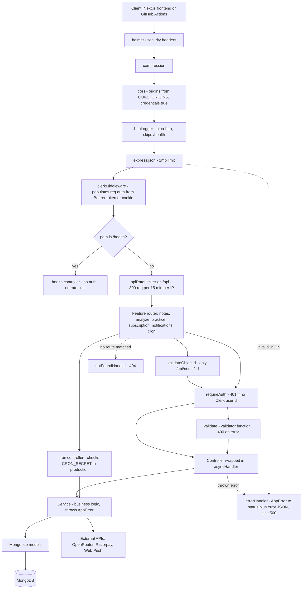
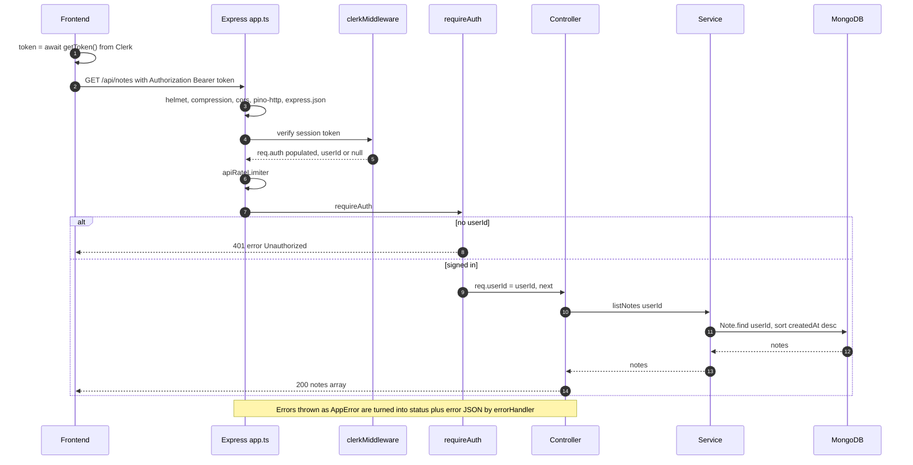
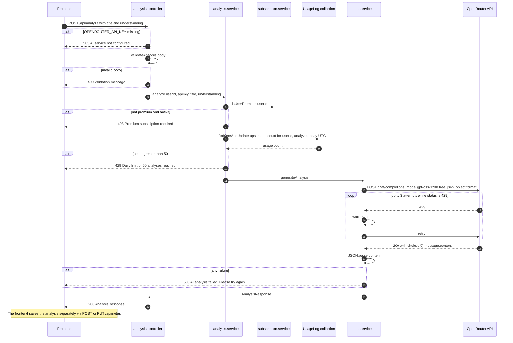
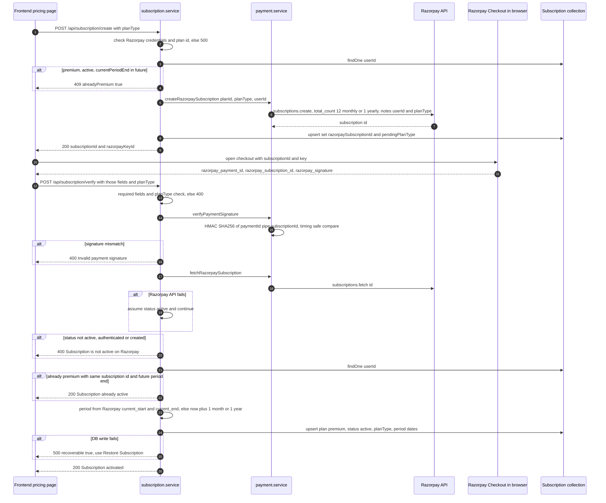
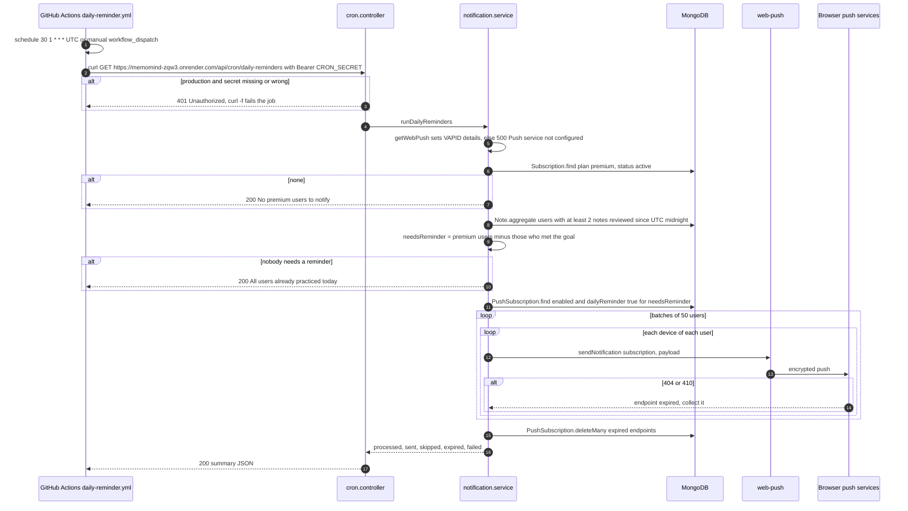
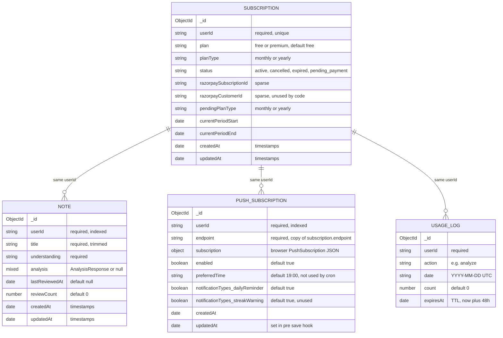

# MemoMind Server (Express Backend)

This document describes the standalone Express backend in `server/`. It is aimed at engineers who are new to the codebase and need to understand how a request travels through the system, which external services are involved, and where to make changes.

The backend was migrated 1:1 from the original Next.js API routes (which still exist under `client/app/api/*` as a fallback). It uses the same MongoDB collections, the same Clerk authentication, and preserves the original response bodies and status codes, so the frontend only needs a different base URL and an `Authorization: Bearer <token>` header.

---

## 1. Overview

### Stack

| Concern | Technology |
| --- | --- |
| Runtime | Node.js >= 20, ES modules (`"type": "module"`, TypeScript `module: NodeNext`) |
| HTTP framework | Express 4 |
| Language | TypeScript 5 (strict), compiled with `tsc` to `dist/`; `tsx watch` in development |
| Database | MongoDB via Mongoose 8 |
| Authentication | Clerk (`@clerk/express`) |
| AI | OpenRouter chat completions API (model `openai/gpt-oss-120b:free`) via native `fetch` |
| Payments | Razorpay subscriptions (`razorpay` SDK) |
| Push notifications | Web Push with VAPID (`web-push`) |
| Security / infra middleware | `helmet`, `cors`, `compression`, `express-rate-limit` |
| Logging | `pino` + `pino-http` (`pino-pretty` in development) |
| Config validation | `zod` + `dotenv` |

### How it runs

1. `src/server.ts` is the entry point. It imports `config/env.ts` (which loads `.env` and validates it with zod, exiting the process on failure), connects to MongoDB, builds the Express app via `createApp()` from `src/app.ts`, and calls `app.listen(PORT)`.
2. `server.ts` registers `SIGTERM`/`SIGINT` handlers that close the HTTP server, disconnect Mongoose, and exit. If connections do not drain within 10 seconds the process force-exits with code 1.
3. `src/app.ts` wires the global middleware chain and mounts one router per feature.

There is **no in-process scheduler**. The daily reminder is triggered externally by a GitHub Actions workflow that calls `GET /api/cron/daily-reminders` (see section 4.4).

### Layering

```
routes  ->  middlewares (requireAuth, validate, validateObjectId)  ->  controllers  ->  services  ->  models
                                                                                        |
                                                                                        +-> config (Razorpay, OpenRouter, env) and utils
```

- **Routes** (`src/routes/*.routes.ts`) declare the HTTP method, path, and the ordered list of middlewares plus the controller.
- **Middlewares** (`src/middlewares/`) handle cross-cutting concerns: auth enforcement, body validation, ObjectId validation, logging, rate limiting, and error translation.
- **Validators** (`src/validators/`) are plain functions `(body) => string | null` returning an error message; they are wrapped by `validate()` in `validation.middleware.ts` (or, in one case, called directly by a controller).
- **Controllers** (`src/controllers/`) are thin: they read the user id and request data, call one service function, and send the result with `sendData()`. They are wrapped in `asyncHandler` so rejected promises reach the error middleware.
- **Services** (`src/services/`) hold all business logic: database access, premium checks, daily limits, AI calls, Razorpay calls, and push delivery. They signal expected failures by throwing `AppError(status, message, extra?)`.
- **Models** (`src/models/`) are Mongoose schemas. Model names match the original app so they map to the same collections.

### Response conventions

- Success responses are the **raw payload** (no envelope), e.g. an array of notes or `{ success: true, message }`.
- Error responses are always `{ "error": "<message>", ...extra }`. `extra` is used for flags such as `alreadyPremium`, `recoverable`, and `notFound`.
- Unknown routes return `404 { "error": "Not found" }`; malformed JSON returns `400 { "error": "Invalid request body" }`; unexpected errors return `500 { "error": "Internal server error" }`.

---

## 2. Request pipeline

The diagram shows the global middleware chain from `app.ts` and how requests fan out to the per-route middlewares and the controller/service/model layers.



Notes on ordering:

- `clerkMiddleware` runs on every request but does **not** reject anonymous requests; `requireAuth` does that per route.
- For `/api/notes/:id` routes, `validateObjectId()` runs **before** `requireAuth`, so an invalid id returns 400 even for unauthenticated callers (this preserves the original Next.js behaviour).
- The cron route has no `requireAuth`; its protection is the `CRON_SECRET` check inside the controller.
- The Express rate limiter is a network-level guard. It is separate from the business limits (100 notes/day, 50 AI analyses/day) enforced in services.

---

## 3. API reference

All `/api/*` routes pass through the rate limiter. "Clerk" means `requireAuth` (a valid Clerk session token, sent as `Authorization: Bearer <token>`). "Premium" means the service checks the `Subscription` collection; unless noted it requires `plan === 'premium'` **and** `status === 'active'` (`isUserPremium`).

| Method | Path | Auth | Validator | Controller | Service | What it does | Request | Response (success) |
| --- | --- | --- | --- | --- | --- | --- | --- | --- |
| GET | `/health` | none | none | `health.controller.health` | none | Liveness plus DB state. Not rate limited, not logged. | none | `200 { status: "ok", db: "connected" \| "disconnected", uptime, timestamp }` |
| GET | `/api/notes` | Clerk | none | `note.controller.list` | `note.service.listNotes` | Lists the user's notes, newest first. | none | `200 Note[]` |
| POST | `/api/notes` | Clerk | `validateCreateNote` | `note.controller.create` | `note.service.createNote` | Creates a note. Enforces 100 notes per UTC day (429). Trims title and understanding. | `{ title, understanding, analysis? }` (title <= 200 chars, understanding <= 10,000) | `201 Note` |
| GET | `/api/notes/:id` | `validateObjectId` then Clerk | none | `note.controller.getById` | `note.service.getNote` | Fetches one note owned by the user. 404 if not found. | none | `200 Note` |
| PUT | `/api/notes/:id` | `validateObjectId` then Clerk | `validateUpdateNote` | `note.controller.update` | `note.service.updateNote` | Partial update of title, understanding, analysis (undefined fields ignored). | `{ title?, understanding?, analysis? }` | `200 Note` (updated) |
| PATCH | `/api/notes/:id` | `validateObjectId` then Clerk | none | `note.controller.review` | `note.service.markReviewed` | Marks a note reviewed: sets `lastReviewedAt = now`, increments `reviewCount`. | none | `200 Note` (updated) |
| DELETE | `/api/notes/:id` | `validateObjectId` then Clerk | none | `note.controller.remove` | `note.service.deleteNote` | Deletes a note owned by the user. | none | `200 { message: "Note deleted successfully" }` |
| POST | `/api/analyze` | Clerk + Premium | `validateAnalysis` (called inside the controller, after the API key check) | `analysis.controller.analyzeNote` | `analysis.service.analyze` then `ai.service.generateAnalysis` | Sends the note to OpenRouter and returns a structured analysis. 503 if `OPENROUTER_API_KEY` is missing, 403 if not premium, 429 after 50 calls per UTC day. Does **not** save the note. | `{ title, understanding }` | `200 AnalysisResponse` (see `types/note.types.ts`) |
| GET | `/api/practice/daily` | Clerk + Premium | none | `practice.controller.daily` | `practice.service.getDailyPractice` | Returns 2 to 5 random notes not yet reviewed today (from the 10 least recently reviewed), or `[]` once 2 notes have been reviewed today. | none | `200 Note[]` (selected fields) |
| GET | `/api/practice/status` | Clerk + Premium | none | `practice.controller.status` | `practice.service.getPracticeStatus` | Daily practice progress counters. | none | `200 { completed, reviewedToday, totalNotes, notesNeedingReview }` |
| POST | `/api/subscription/create` | Clerk | `validateCreateSubscription` | `subscription.controller.create` | `subscription.service.createSubscription` | Creates a Razorpay subscription for the plan and stores its id as pending. 409 if already premium with a future period end. | `{ planType: "monthly" \| "yearly" }` | `200 { subscriptionId, razorpayKeyId }` |
| POST | `/api/subscription/verify` | Clerk | none (checked in service) | `subscription.controller.verify` | `subscription.service.verifyPayment` | Verifies the Razorpay HMAC signature, cross-checks status with Razorpay, and activates premium. | `{ razorpay_subscription_id, razorpay_payment_id, razorpay_signature, planType }` | `200 { success: true, message }` |
| POST | `/api/subscription/restore` | Clerk | none | `subscription.controller.restore` | `subscription.service.restoreSubscription` | Recovers a paid subscription that was not activated: tries a user-provided id, then the stored id, then searches the latest 100 Razorpay subscriptions by `notes.userId`. | `{ subscriptionId? }` | `200 { alreadyActive: true, message }` or `200 { success: true, message, planType, validUntil }` |
| GET | `/api/subscription/status` | Clerk | none | `subscription.controller.status` | `subscription.service.getStatus` | Returns the user's plan. Creates a free `Subscription` record on first call. | none | `200 { isPremium, plan, status, currentPeriodEnd }` |
| GET | `/api/notifications/subscribe` | Clerk | none | `notification.controller.getStatus` | `notification.service.getStatus` | Returns push subscription state (reads the first matching record only). | none | `200 { subscribed: false }` or `200 { subscribed: true, enabled, preferredTime, notificationTypes }` |
| POST | `/api/notifications/subscribe` | Clerk | `validatePushSubscription` | `notification.controller.subscribe` | `notification.service.subscribe` | Upserts a push subscription for (user, endpoint) and re-enables it. | Browser `PushSubscription` JSON: `{ endpoint, keys: { p256dh, auth } }` | `200 { success: true, message, subscriptionId }` |
| PATCH | `/api/notifications/subscribe` | Clerk | none (inline checks) | `notification.controller.updatePreferences` | `notification.service.updatePreferences` | Updates `preferredTime` (only if `HH:MM`) and/or `enabled` on **all** of the user's devices. 404 if none. | `{ preferredTime?, enabled? }` | `200 { success: true }` |
| DELETE | `/api/notifications/subscribe` | Clerk | none | `notification.controller.remove` | `notification.service.remove` | Deletes one device (if `endpoint` given) or all of the user's push subscriptions. | `{ endpoint? }` | `200 { success: true, message }` |
| POST | `/api/notifications/send` | Clerk + Premium (plan only, see note) | none | `notification.controller.send` | `notification.service.send` | Sends a test/manual push to the caller's own devices; removes expired endpoints. 503 if VAPID not configured, 403 if `targetUserId` is someone else. | `{ targetUserId?, title?, body?, url? }` | `200 { success: true, message: "Notification sent to N device(s)" }` |
| GET | `/api/cron/daily-reminders` | `Authorization: Bearer <CRON_SECRET>` in production only | none | `cron.controller.dailyReminders` | `notification.service.runDailyReminders` | Sends the daily reminder push to active premium users who have not met today's practice goal. | none | `200 { success, processed, sent, skipped, expired, failed }` or `200 { message, processed: 0 }` |

Notes:

- `/api/notifications/send` checks only `plan === 'premium'`, not `status`. This inconsistency is intentional (preserved from the original route, per a code comment).
- Outside production (`NODE_ENV !== 'production'`), the cron endpoint is **unauthenticated**.
- In `/api/analyze`, the daily usage counter is incremented before the AI call, so failed AI calls still count toward the 50/day limit.

---

## 4. Sequence diagrams

### 4.1 Authenticated request (Clerk token)



### 4.2 Note analysis via OpenRouter



### 4.3 Razorpay subscription: create then verify



### 4.4 Daily reminder cron (GitHub Actions to web-push)



The workflow comment explains the schedule: 01:30 UTC is 07:00 IST nominally, but GitHub Actions scheduled runs are often delayed, so it tends to land around 09:00 IST. Delivery also depends on the Render instance being awake (a free-tier instance may cold-start; this is an inference, not something the code handles).

---

## 5. Data model

All models are keyed by the Clerk `userId` string; there are no Mongoose `ref`s between collections. The relationships below are logical.



Indexes declared in the schemas:

- `Note`: `{ userId: 1, createdAt: -1 }`, `{ userId: 1, lastReviewedAt: 1 }`, plus `userId`.
- `Subscription`: unique `userId`.
- `PushSubscription`: unique `{ userId: 1, endpoint: 1 }`, plus `userId`.
- `UsageLog`: unique `{ userId: 1, action: 1, date: 1 }`, TTL on `expiresAt` (`expireAfterSeconds: 0`).

Important: `database.ts` connects with `autoIndex: false`, so Mongoose does **not** create these indexes at startup. They must already exist in the Atlas cluster (they were presumably created by the original Next.js app or manually; this is not verified from the server code).

`notificationTypes` is stored as a nested object in MongoDB; the ER diagram flattens it because Mermaid does not support nested attributes.

---

## 6. Environment variables

Defined and validated in `src/config/env.ts`. Only the database and Clerk keys are required at boot; feature keys are checked when the feature is used, so a missing key produces an HTTP error on that endpoint rather than a crash.

| Name | Required | Default | Purpose |
| --- | --- | --- | --- |
| `PORT` | no | `4000` | HTTP port (coerced to a number). |
| `NODE_ENV` | no | `development` | `development`, `production` or `test`. `production` enables the `CRON_SECRET` check and disables `pino-pretty`. |
| `CORS_ORIGINS` | no | `http://localhost:3000` | Comma-separated allowed frontend origins. If it parses to an empty list, CORS reflects any origin. |
| `CLERK_PUBLISHABLE_KEY` | **yes** | none | Clerk publishable key for `clerkMiddleware`. |
| `CLERK_SECRET_KEY` | **yes** | none | Clerk secret key used to verify session tokens. |
| `MONGODB_URI` | **yes** | none | MongoDB connection string (same Atlas cluster as the client app). |
| `OPENROUTER_API_KEY` | no | none | OpenRouter key. If missing, `/api/analyze` returns 503. |
| `APP_URL` | no | `https://memomind.vercel.app` | Sent as the `HTTP-Referer` header to OpenRouter. |
| `RAZORPAY_KEY_ID` | no | none | Razorpay key id; also returned to the frontend for Checkout. Missing means 500 "Payment gateway not configured". |
| `RAZORPAY_KEY_SECRET` | no | none | Razorpay secret; used for the API client and HMAC signature verification. |
| `RAZORPAY_PLAN_ID_MONTHLY` | no | none | Razorpay plan id for the monthly plan. |
| `RAZORPAY_PLAN_ID_YEARLY` | no | none | Razorpay plan id for the yearly plan. |
| `VAPID_PUBLIC_KEY` | no | none | Web Push VAPID public key. |
| `VAPID_PRIVATE_KEY` | no | none | Web Push VAPID private key. |
| `VAPID_EMAIL` | no | none | Contact email; prefixed with `mailto:` for VAPID. All three VAPID values are needed or push endpoints fail (503 for send, 500 for cron). |
| `CRON_SECRET` | no (but effectively required in production for the cron to work) | none | Bearer token required by `/api/cron/daily-reminders` in production. Must match the `CRON_SECRET` GitHub Actions secret. |
| `LOG_LEVEL` | no | `debug` in dev, `info` in prod | Pino log level. Not listed in `.env.example`. |

The README also mentions `ENABLE_CRON`; that variable is **not** read anywhere in the current code (the in-process `node-cron` job was removed).

---

## 7. Per-file reference

### Root of `server/`

- **`package.json`** - Declares the `memomind-server` ESM package (Node >= 20) and its scripts: `dev` (`tsx watch src/server.ts`), `build` (`tsc`), `start` (`node dist/server.js`), `typecheck`, and `lint`. Note that `@types/*` and `typescript` are listed under `dependencies` (needed because the Docker build installs them), and `lint` calls `eslint`, which is **not** installed as a dependency, so `npm run lint` will fail as-is.
- **`package-lock.json`** - npm lockfile used by `npm ci` in the Dockerfile.
- **`tsconfig.json`** - Strict TypeScript config targeting ES2022 with `module`/`moduleResolution: NodeNext`, compiling `src/` to `dist/` with source maps. Because of NodeNext, relative imports must use the `.js` extension (e.g. `./config/env.js`). `noUnusedLocals` is on.
- **`Dockerfile`** - Two-stage `node:20-alpine` build: the build stage installs all deps and runs `npm run build`; the runtime stage installs production deps only and copies `dist/`. Exposes 4000, runs `node dist/server.js`, and has a `HEALTHCHECK` that fetches `/health` on `$PORT`.
- **`.dockerignore`** - Excludes `node_modules`, `dist`, `.env`, `.env.local`, logs and `.git` from the Docker build context.
- **`.gitignore`** - Ignores `node_modules`, `dist`, `.env`, `.env.local` and logs.
- **`.env.example`** - Template of all environment variables with comments (see section 6). Copy to `.env` for local development.
- **`.env`** - Local, gitignored secrets file loaded by `dotenv/config`. It contains the same keys as `.env.example`. Never commit it.
- **`README.md`** - Quick-start, env mapping from the Next.js names, endpoint list, cross-origin auth notes and a suggested frontend `useApi()` helper. Parts are **outdated**: it still describes a `jobs/` folder, `node-cron`, and `ENABLE_CRON`, none of which exist anymore.

### `src/`

- **`server.ts`** - Process entry point. Connects to MongoDB, creates the app, starts listening on `env.PORT`, and installs graceful shutdown on `SIGTERM`/`SIGINT` (10-second forced exit). Any bootstrap failure is logged as fatal and exits with code 1.
- **`app.ts`** - Exports `createApp()`, which builds the Express app: `trust proxy = 1`, helmet, compression, CORS, pino-http, JSON body parser (1 MB), Clerk middleware, `/health`, the `/api` rate limiter, the six feature routers, and finally the 404 and error handlers. Called only by `server.ts`.

### `src/config/`

- **`env.ts`** - Loads `.env` via `dotenv/config`, validates `process.env` with a zod schema, and exits the process with a logged list of issues if validation fails. Exports `env` (typed config), `isProd`, and `corsOrigins` (parsed from `CORS_ORIGINS`). Imported by almost every config module and by `server.ts`.
- **`database.ts`** - Exports `connectDatabase()` and `disconnectDatabase()`. Caches the connection, sets `strictQuery`, and connects with `bufferCommands: false` (queries fail immediately if not connected) and `autoIndex: false` (schema indexes are not built automatically).
- **`clerk.ts`** - Exports `clerk`, a configured `clerkMiddleware` instance that populates `req.auth` from a Bearer token or Clerk cookie. Mounted globally in `app.ts`; it does not block anonymous requests.
- **`openrouter.ts`** - Constants `OPENROUTER_URL` and `OPENROUTER_MODEL` (`openai/gpt-oss-120b:free`) plus getters `getOpenRouterApiKey()` and `getAppReferer()`. Used by `analysis.controller` and `ai.service`.
- **`razorpay.ts`** - Exports `getRazorpayCredentials()`, `getPlanId(planType)` and `createRazorpayClient()` (returns `null` when credentials are missing). A new Razorpay client is constructed on every call. Used by `payment.service`.

### `src/routes/`

- **`health.routes.ts`** - `GET /` mapped to `health`. Mounted at `/health`.
- **`note.routes.ts`** - Notes CRUD under `/api/notes`. Collection routes use `requireAuth`; `/:id` routes run `validateObjectId()` before `requireAuth`. `POST` uses `validateCreateNote`; `PUT` uses `validateUpdateNote`; `PATCH` means "mark reviewed", not a partial update.
- **`analysis.routes.ts`** - `POST /` with `requireAuth` to `analyzeNote`. Mounted at `/api/analyze`. Validation happens inside the controller.
- **`practice.routes.ts`** - `GET /daily` and `GET /status`, both `requireAuth`. Mounted at `/api/practice`.
- **`subscription.routes.ts`** - `POST /create` (with `validateCreateSubscription`), `POST /verify`, `POST /restore`, `GET /status`, all `requireAuth`. Mounted at `/api/subscription`.
- **`notification.routes.ts`** - `GET`/`POST`/`PATCH`/`DELETE /subscribe` and `POST /send`, all `requireAuth`; `POST /subscribe` uses `validatePushSubscription`. Mounted at `/api/notifications`.
- **`cron.routes.ts`** - `GET /daily-reminders` to `dailyReminders`, with **no** `requireAuth` (the controller checks `CRON_SECRET`). Mounted at `/api/cron`.

### `src/middlewares/`

- **`auth.middleware.ts`** - `requireAuth` reads `getAuth(req).userId` and returns `401 { error: "Unauthorized" }` if absent; otherwise it stores the id on `req.userId`. `getUserId(req)` reads it back and is used by every authenticated controller. Requires `clerkMiddleware` to have run first.
- **`validation.middleware.ts`** - `validate(fn)` wraps a validator and returns `400 { error }` when it yields a message. `validateObjectId(param = 'id')` returns `400 { error: "Invalid note ID" }` for non-ObjectId values (the message is note-specific even though the helper is generic). Also exports the `Validator` type.
- **`error.middleware.ts`** - `notFoundHandler` (404 `Not found`) and `errorHandler`. The error handler maps JSON parse errors to 400 `Invalid request body`, `AppError` to its status with `{ error, ...extra }` (logging only 5xx), and anything else to 500 `Internal server error`.
- **`logger.middleware.ts`** - `httpLogger`, a `pino-http` instance using the shared logger that skips automatic logging for `/health`.
- **`rateLimit.middleware.ts`** - `apiRateLimiter`: 300 requests per 15 minutes per client IP (IP derived via `trust proxy`), standard `RateLimit-*` headers, JSON 429 message. Uses the default in-memory store, so limits are per process and reset on restart.

### `src/validators/`

All validators return an error string or `null` and preserve the exact messages of the original routes.

- **`note.validator.ts`** - `validateCreateNote` requires non-blank `title` and `understanding` and enforces the 200 / 10,000 character limits. `validateUpdateNote` only enforces the length limits on fields that are present.
- **`analysis.validator.ts`** - `validateAnalysis`: same rules as note creation but with the message "Both title and understanding are required". Called directly by `analysis.controller` (not via `validate()`), so the 503 API-key check runs first.
- **`subscription.validator.ts`** - `validateCreateSubscription` requires `planType` to be `monthly` or `yearly`.
- **`notification.validator.ts`** - `validatePushSubscription` only checks that `endpoint` is present; `keys` are not validated.

### `src/controllers/`

All controllers except `health` are wrapped in `asyncHandler` and respond via `sendData`.

- **`health.controller.ts`** - `health` returns status, Mongo `readyState`-based DB state, process uptime and a timestamp.
- **`note.controller.ts`** - `list`, `getById`, `create` (responds 201), `update`, `review`, `remove`; each delegates to the matching `note.service` function.
- **`analysis.controller.ts`** - `analyzeNote` checks the OpenRouter key (503), validates the body (400), then calls `analysis.service.analyze`. The order is deliberate to mirror the original route.
- **`practice.controller.ts`** - `daily` and `status`, delegating to `practice.service`.
- **`subscription.controller.ts`** - `create`, `verify`, `restore` (trims an optional `subscriptionId` from the body) and `status`. `create` casts `req.body.planType` after the route validator has checked it.
- **`notification.controller.ts`** - `subscribe`, `getStatus`, `updatePreferences`, `remove` (passes `endpoint` only if it is a string) and `send`.
- **`cron.controller.ts`** - `dailyReminders` enforces `Authorization: Bearer <CRON_SECRET>` when `isProd` (401 otherwise, including when the secret is unset) and returns the result of `runDailyReminders()`. In non-production environments it is open.

### `src/services/`

- **`note.service.ts`** - `listNotes`, `getNote`, `createNote`, `updateNote`, `markReviewed`, `deleteNote`. Every query is scoped by `{ _id, userId }`, so users can only touch their own notes. `createNote` enforces `DAILY_NOTE_LIMIT` (100 per UTC day, 429). Unexpected DB errors are converted to 500 `AppError`s with operation-specific messages.
- **`analysis.service.ts`** - `analyze` checks premium (403), atomically upserts and increments a `UsageLog` row for `(userId, "analyze", YYYY-MM-DD)` with a 48-hour TTL, rejects when the count exceeds 50 (429), then calls `ai.service.generateAnalysis`. The counter increments before the AI call, so failures and rejected attempts also count.
- **`ai.service.ts`** - `generateAnalysis` builds a fixed JSON-schema prompt and POSTs it to OpenRouter with `response_format: json_object` and `max_tokens: 2000`. On HTTP 429 it retries up to 3 total attempts with 1s/2s backoff. Any error (non-OK status, empty content, invalid JSON) is logged and rethrown as `AppError(500, 'AI analysis failed. Please try again.')`. The parsed JSON is not schema-validated.
- **`practice.service.ts`** - `getDailyPractice` returns `[]` once `PRACTICE_DAILY_GOAL` (2) notes were reviewed today; otherwise it takes the 10 least recently reviewed notes not reviewed today, shuffles them (Fisher-Yates), and returns 2 to 5 of them. `getPracticeStatus` returns counters. Both require premium (403).
- **`subscription.service.ts`** - `isUserPremium` (used by analysis and practice), `getStatus` (creates a free record if missing), `createSubscription`, `verifyPayment` and `restoreSubscription` (see section 4.3). Notable behaviour: if the Razorpay fetch fails during verify, the service assumes `active` and activates on the strength of the HMAC signature alone; `verifyPayment` does not clear `pendingPlanType` but the restore path does. There is no webhook handling, so cancellations or expiries are never written back automatically (the `subscription.status.expired` log event is declared but unused).
- **`payment.service.ts`** - Thin Razorpay wrapper: `logPayment` (structured `[PAYMENT]` logs with `signature`/`key`/`secret` stripped), `hasRazorpayCredentials`, `verifyPaymentSignature`, `createRazorpaySubscription` (`total_count` 12 for monthly, 1 for yearly, `notes: { userId, planType }`), `fetchRazorpaySubscription`, `listRazorpaySubscriptions`. Re-exports `getRazorpayCredentials` and `getPlanId`. Throws 500 if the client cannot be created.
- **`notification.service.ts`** - Push subscription CRUD (`subscribe`, `getStatus`, `updatePreferences`, `remove`), a manual `send`, and the batch job `runDailyReminders` (see section 4.4). Both senders delete endpoints that return 404/410. `getWebPush()` sets VAPID details on the global `web-push` module on each call. `preferredTime` and `streakWarning` are stored but not used by any sending logic.

### `src/models/`

All models use the ESM-safe pattern `import mongoose from 'mongoose'; const { Schema, model, models } = mongoose;` and `models.X || model('X', schema)` to avoid re-registration. See section 5 for fields.

- **`Note.ts`** - `Note` model and `INote` interface. `analysis` is `Mixed` (stores an `AnalysisResponse`), timestamps enabled.
- **`Subscription.ts`** - `Subscription` model and `ISubscription`: one document per user (unique `userId`) holding plan, status, Razorpay ids and the current period. `razorpayCustomerId` is declared but never written.
- **`PushSubscription.ts`** - `PushSubscription` model and `IPushSubscription`: one document per (user, device endpoint). A `pre('save')` hook updates `updatedAt`, but services use `findOneAndUpdate`/`updateMany`, which bypass it, so they set `updatedAt` manually.
- **`UsageLog.ts`** - `UsageLog` model and `IUsageLog`: per-user, per-action, per-day counters with a TTL on `expiresAt`. Currently only the `analyze` action is used.

### `src/types/`

- **`common.types.ts`** - `AuthedRequest`, an Express `Request` with `userId: string`, used by the auth middleware.
- **`note.types.ts`** - `AnalysisResponse` (the AI result shape: cleaned explanation, key points, gaps, summary, difficulty, accuracy score, next concepts, quick quiz), `QuizQuestion`, `AnalysisRequest`, `CreateNoteInput`, `UpdateNoteInput`, `PracticeStatus`.
- **`notification.types.ts`** - `WebPushSubscription` (browser subscription JSON), `SendNotificationInput`, `NotificationStatusResponse`.
- **`subscription.types.ts`** - `RzpSubscription` (the subset of Razorpay's subscription object the code relies on), `VerifyPaymentInput`, `SubscriptionStatusResponse` (declared but not referenced by the services).

### `src/utils/`

- **`appError.ts`** - `AppError(statusCode, message, extra?)`, the operational error type thrown by services and translated by `errorHandler`; `extra` is merged into the JSON body.
- **`asyncHandler.ts`** - Wraps an async handler and forwards rejections to `next`, since Express 4 does not catch promise rejections itself.
- **`constants.ts`** - `LIMITS` (title 200, understanding 10,000, 100 notes/day, 50 analyses/day, practice goal 2), `VALID_PLAN_TYPES` and `PlanType`, `RAZORPAY_VALID_VERIFY_STATUSES` (`active`, `authenticated`, `created`), `RAZORPAY_PAID_STATUSES` (`active`, `authenticated`, `completed`), and `CRON` (reminder title/body, batch size 50).
- **`date.ts`** - `utcMidnight()` (start of the current UTC day; all "today" logic is UTC, not the user's timezone), `isoDateKey()` (UTC `YYYY-MM-DD`), `addMonths()`, `addYears()` (these two use local-time setters).
- **`encryption.ts`** - `hmacSha256Hex()` and `verifyRazorpaySignature()`, which computes `HMAC_SHA256(secret, "paymentId|subscriptionId")` and compares with `crypto.timingSafeEqual`.
- **`logger.ts`** - Shared `pino` logger. Reads `NODE_ENV` and `LOG_LEVEL` directly from `process.env` (not from `env.ts`, to avoid a circular import) and uses `pino-pretty` outside production. Because `pino-pretty` is a dev dependency, running the production image with `NODE_ENV` unset would try to load it and fail; the Dockerfile sets `NODE_ENV=production` to avoid this.
- **`response.ts`** - `sendData(res, data, status = 200)` and `sendError(res, message, status = 500, extra?)`, which keep the original unwrapped response shapes.

### `.github/workflows/daily-reminder.yml` (repository root)

Scheduled GitHub Actions workflow (`30 1 * * *` UTC, plus manual `workflow_dispatch`) that runs `curl -fsS` against `https://memomind-zqw3.onrender.com/api/cron/daily-reminders` with `Authorization: Bearer ${{ secrets.CRON_SECRET }}`. A non-2xx response fails the job. The backend URL is hard-coded, so it must be updated if the Render service moves.

---

## 8. Deployment and local development

### Local development

```bash
cd server
npm install
cp .env.example .env        # fill in at least CLERK_*, MONGODB_URI
npm run dev                 # tsx watch, http://localhost:4000
curl http://localhost:4000/health
```

Other scripts:

```bash
npm run typecheck           # tsc --noEmit
npm run build               # compile src/ to dist/
npm start                   # node dist/server.js
```

Tips:

- With `NODE_ENV=development` the cron endpoint is open, so you can trigger reminders locally with `curl http://localhost:4000/api/cron/daily-reminders` (this sends real pushes if VAPID keys and subscriptions exist).
- Authenticated endpoints need a Clerk session token in `Authorization: Bearer <token>`. In the browser, obtain it with Clerk's `getToken()`.
- Set `CORS_ORIGINS` to include your frontend origin (default `http://localhost:3000`).

### Docker

```bash
cd server
docker build -t memomind-server .
docker run -p 4000:4000 --env-file .env memomind-server
```

The image runs `node dist/server.js` with `NODE_ENV=production`, exposes port 4000 (the app honours `$PORT` if the platform sets one), and includes a `HEALTHCHECK` against `/health`.

### Render

The production backend is hosted on Render at `https://memomind-zqw3.onrender.com`; this is known only from the GitHub Actions workflow. There is **no** `render.yaml` in the repository, so the service configuration (Docker vs. native Node build, root directory, instance type) lives in the Render dashboard and cannot be confirmed from the code. A native Node deployment would use `npm install && npm run build` as the build command and `npm start` as the start command, with `server/` as the root directory.

Production checklist:

- Set `NODE_ENV=production`, `CLERK_PUBLISHABLE_KEY`, `CLERK_SECRET_KEY`, `MONGODB_URI`, and `CORS_ORIGINS` (the deployed frontend origin).
- Set the feature keys you need: `OPENROUTER_API_KEY`, the four `RAZORPAY_*` values, the three `VAPID_*` values.
- Set `CRON_SECRET` on Render and the same value as the `CRON_SECRET` secret in the GitHub repository, otherwise the daily reminder job receives 401.
- Make sure the MongoDB indexes exist (see section 5), because the server does not build them (`autoIndex: false`).
- The rate limiter is in-memory; if you scale to multiple instances, each has its own counters.
